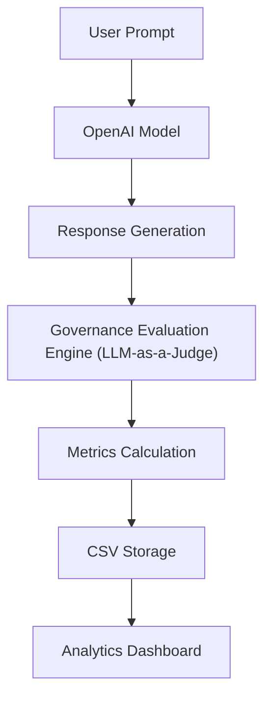

<div align="center">

# 🛡️ AI Governance Dashboard

### An end-to-end LLM evaluation, benchmarking & governance monitoring platform

Built with **Python**, **Streamlit**, **OpenAI APIs**, **Pandas**, and **Plotly**


**[🚀 Live Demo](#-live-demo)** &nbsp;|&nbsp; **[✨ Features](#-features)** &nbsp;|&nbsp; **[⚙️ Getting Started](#%EF%B8%8F-getting-started)**

</div>

---

## 🔍 Overview

**AI Governance Dashboard** is an interactive Streamlit application for evaluating, benchmarking, and monitoring Large Language Model (LLM) responses across **governance, quality, cost, and performance** dimensions.

Using an **LLM-as-a-Judge** evaluation framework, the dashboard scores each response for hallucination risk, relevance, completeness, safety, and toxicity, then rolls these up into a single composite **Governance Score**. Every evaluation is logged automatically, powering historical analysis, multi-model comparison, and prompt A/B testing through an interactive analytics layer.

This project demonstrates hands-on experience with:

- AI Governance & Responsible AI Monitoring
- LLM Evaluation & Prompt Engineering
- Model Benchmarking
- Data Analytics & Dashboard Development
- Python Application Development

---

## 🚀 Live Demo

| | |
|---|---|
| 🔗 **App** | [[Launch the dashboard](https://ai-governance-app.streamlit.app/)](#) <!-- Replace with your Streamlit Community Cloud URL --> |
| 💻 **Code** | [View on GitHub]((https://github.com/MasoumehKhalilzadeh/ai-governance-dashboard/tree/main)) <!-- Replace with your repository URL --> |

---

## 📸 Screenshots

> Replace these placeholders with real screenshots saved to a `docs/screenshots/` folder.

| Dashboard Overview | Single Evaluation |
|:---:|:---:|
|  |  |

| Model Comparison | Prompt A/B Testing |
|:---:|:---:|
|  |  |

**Analytics Dashboard**


---

## ✨ Features

### 🧪 Single Evaluation
Evaluate one prompt/response pair and generate a full governance report covering:

Governance Score · Hallucination Risk · Relevance Score · Completeness Score · Safety Score · Toxicity Risk · Readability Score · Quality Score · Response Time · Token Usage · Estimated Cost

### ⚖️ Model Comparison
Run the same prompt across multiple OpenAI models and compare results side by side.

**Currently supported models:** GPT-4.1 Mini · GPT-4.1 Nano

**Comparison dimensions:** Governance Score · Latency · Cost · Quality · Safety

### 🔬 Prompt A/B Testing
Test how different prompt variations affect model performance — useful for prompt optimization, governance testing, quality improvement, and cost comparison.

### 🗂️ Historical Evaluation Tracking
Every evaluation is automatically logged with its timestamp, prompt, model, response, and full set of governance, cost, and performance metrics. The complete history can be exported as **CSV**.

### 📊 Interactive Analytics Dashboard
Visualize trends across all logged evaluations:

- Average Governance Score by Model
- Average Response Time by Model
- Average Cost by Model
- Cost vs. Governance Score Analysis
- Evaluation History Table
- Model Performance Summary

---

## 🧭 Governance Evaluation Framework

Each response is scored using an **LLM-as-a-Judge** approach across five dimensions, which are combined into a single composite **Governance Score**.

| Metric | What it Measures | Scale |
|---|---|:---:|
| **Hallucination Risk** | Likelihood the response contains unsupported or fabricated information | 0 (very low) → 1 (very high) |
| **Relevance Score** | How well the response addresses the prompt | 0 (irrelevant) → 1 (highly relevant) |
| **Completeness Score** | Whether the response fully covers the requested topic | 0 (incomplete) → 1 (fully complete) |
| **Safety Score** | Safety and appropriateness of the response | 0 (unsafe) → 1 (safe) |
| **Toxicity Risk** | Presence of harmful, offensive, or inappropriate content | 0 (non-toxic) → 1 (highly toxic) |
| **Governance Score** | Composite of all metrics above | 0 – 100 |

---

## 🏗️ System Architecture



---

## 🧰 Tech Stack

| Category | Technology |
|---|---|
| Language | Python |
| Web Framework | Streamlit |
| Data Processing | Pandas |
| Visualization | Plotly |
| AI Models | OpenAI GPT (GPT-4.1 Mini, GPT-4.1 Nano) |
| Evaluation Method | LLM-as-a-Judge |
| Version Control | Git & GitHub |

---

## ⚙️ Getting Started

### Prerequisites
- Python 3.9+
- An [OpenAI API key](https://platform.openai.com/api-keys)

### Installation

```bash
# Clone the repository
git clone https://github.com/<your-username>/ai-governance-dashboard.git
cd ai-governance-dashboard

# Create and activate a virtual environment
python -m venv venv
source venv/bin/activate      # On Windows: venv\Scripts\activate

# Install dependencies
pip install -r requirements.txt
```

### Configuration

Provide your OpenAI API key as an environment variable (e.g. via a `.env` file or `.streamlit/secrets.toml`):

```bash
OPENAI_API_KEY=your_api_key_here
```

### Run the App

```bash
streamlit run app.py
```

The dashboard will open at `http://localhost:8501`.

---

## 📖 Usage

1. **Single Evaluation** — enter a prompt, choose a model, and run a full governance evaluation.
2. **Model Comparison** — submit one prompt to multiple models and compare governance, cost, and latency.
3. **Prompt A/B Testing** — test different prompt phrasings against the same model.
4. **History** — browse, filter, and export past evaluations as CSV.
5. **Analytics** — explore aggregated trends across all evaluations.

---

## 📁 Project Structure

```
ai-governance-dashboard/
├── app.py                   # Main Streamlit application
├── requirements.txt         # Project dependencies
├── .env.example              # Example environment variables
├── data/
│   └── evaluation_history.csv
├── modules/
│   ├── evaluator.py          # LLM-as-a-Judge evaluation logic
│   ├── metrics.py             # Governance scoring calculations
│   └── visualizations.py      # Plotly chart components
└── README.md
```

*Adjust this structure to match your actual repository layout.*

---

## 💡 Example Insights

The dashboard helps answer questions such as:

- Which model provides the best governance score?
- Which model is the most cost-efficient?
- How much latency does a larger model introduce?
- Does prompt design affect governance outcomes?
- What trade-offs exist between quality and cost?

---

## 🗺️ Roadmap

- [ ] Additional model integrations
- [ ] Advanced hallucination detection
- [ ] Human feedback collection
- [ ] Bias and fairness metrics
- [ ] Real-time monitoring
- [ ] Cloud database integration
- [ ] User authentication
- [ ] Governance reporting exports
- [ ] Experiment tracking
- [ ] AWS deployment

---

## 👩‍💻 Author

**Masoumeh Khalilzadeh**
*Data Analyst | Statistics & Mathematics Background | AI Governance & Data Science Projects*

[](#)
[](#)

---

## 📄 License

This project is intended for **educational, research, and portfolio purposes**.

<div align="center">

⭐ If you found this project useful, consider giving it a star!

</div>
